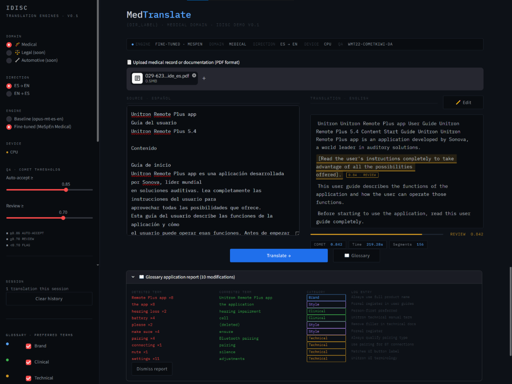

# Personalized Translation Engines
> A modular Spanish–English Machine Translation system with domain-specific fine-tuning for Medical, Legal, and Automotive sectors. Includes a Human-in-the-Loop QA module with COMET-based confidence scoring, per-segment heatmaps, and a glossary correction pipeline.

 ---

## Project Overview

The objective of this project is to develop a modular AI translation system for **iDISC**. The core strategy is to use one robust **General Translation Engine** (Spanish–English) and fine-tune it into domain-specific versions: **Automotive**, **Legal/Regulatory**, and **Medical**.

The system delivers high-quality, trustworthy translations that maintain terminology consistency, adhere to client "Brand Voice," and preserve formatting integrity. The prototype features a fully functional Streamlit interface that balances automated efficiency with the precision required for high-stakes language.

---

## Repository Structure

```
.
├── app.py                          # Streamlit demo interface
├── glossary.py                     # Modular glossary, terminology rules, and text utilities
├── evaluate_pdfs.py                # PDF translation evaluation pipeline (BLEU, ChrF, COMET)
├── mespen-medical-finetune.ipynb   # Fine-tuning pipeline (MeSpEn / PubMed dataset)
├── nllb-baseline.ipynb             # NLLB-200 baseline experiments
├── sp-test.ipynb                   # Sanity-check / scratchpad notebook
├── requirements.txt
├── mespen_data/                    # Raw MeSpEn dataset files
│   └── medlineplus_extracted/      # Extracted XML health topic files
├── pdfs/                           # Paired ES/EN PDF test documents
└── results/
    └── results.csv                 # PDF evaluation results (BLEU, ChrF, COMET)
```

---

## Setup & Installation

### Prerequisites

- Python 3.9+
- pip
- (Recommended) A virtual environment

### 1. Clone the repository

```bash
git clone https://github.com/Gusgus127/Personalized-Translation-Engines
cd personalized-translation-engines
```

### 2. Create and activate a virtual environment

```bash
python -m venv venv

# macOS / Linux
source venv/bin/activate

# Windows
venv\Scripts\activate
```

### 3. Install dependencies

```bash
pip install -r requirements.txt
```

---

## Running the Web App

```bash
streamlit run app.py
```

The app opens at `http://localhost:8501`.

### Features

| Feature | Description |
|---|---|
| **Split-screen editor** | Source (ES or EN) on the left, translation on the right |
| **Direction toggle** | Switch between ES → EN and EN → ES in the sidebar |
| **Engine selector** | Switch between Baseline (`opus-mt-es-en`) and Fine-tuned model |
| **COMET confidence bar** | Per-translation score with Green / Amber / Red classification |
| **Segment heatmap** | Per-sentence confidence coloring directly on the output text |
| **Segment editing mode** | Inline editor for flagged segments; auto-accept segments shown as text inputs |
| **Glossary correction** | One-click application of brand, clinical, technical, and style rules with a detailed report |
| **Quick examples** | 5 pre-loaded medical sentences in each direction |
| **Baseline vs Fine-tuned comparator** | Side-by-side comparison on any input text |
| **Translation history** | Full session log with QA labels, exportable as JSON |
| **PDF upload** | Text extraction from uploaded PDFs for direct translation |


## Model Loading

Models are hosted on Hugging Face Hub for easy access:

| Model | HF ID | Direction |
|-------|-------|-----------|
| Baseline ES→EN | Downloaded automatically from HuggingFace (`Helsinki-NLP/opus-mt-es-en`) | Spanish → English |
| Baseline EN→ES | Downloaded automatically from HuggingFace (`Helsinki-NLP/opus-mt-en-es`) | English → Spanish |
| Medical Fine-tuned (ES→EN) | `Gusgus127/mespen-medical-es-en` | Spanish → English |
| Medical Fine-tuned (EN→ES) | `Gusgus127/mespen-medical-en-es` | English → Spanish |

The app automatically downloads models on first run (cached locally). No manual download needed! (but may take a while the first time)
If a fine-tuned model directory is missing, the app falls back gracefully to the baseline only.

### COMET QA Thresholds

> **Note:** We use the Kiwi model from HuggingFace. The very first time this model loads, it will take some additional time to download and initialize.

| Color | Score | Action |
| :--- | :--- | :--- |
| ⚪ **Transparent** | $\ge 0.85$ | **AUTO-ACCEPT** |
| 🟡 **Amber** | $0.70 \le \text{Score} < 0.85$ | Review recommended |
| 🔴 **Red** | $< 0.70$ | Mandatory human intervention |

---

#### 🔑 Configuration for COMET Kiwi Model

The application utilizes [Unbabel/wmt22-cometkiwi-da](https://huggingface.co/Unbabel/wmt22-cometkiwi-da) for higher-quality quality estimation. Because this model requires authentication, please follow these steps to enable it:

1. **Accept the license** on the official model page: [Unbabel/wmt22-cometkiwi-da](https://huggingface.co/Unbabel/wmt22-cometkiwi-da)
2. **Create a "Read" token** in your Hugging Face settings: [huggingface.co/settings/tokens](https://huggingface.co/settings/tokens)
3. **Log in via CLI** and paste your token when prompted:
   ```bash
   huggingface-cli login

---

## Running the Fine-tuning Notebook

Open `mespen-medical-finetune.ipynb` in Jupyter or upload it to Google Colab / Kaggle.

The notebook covers:

1. Downloading the MeSpEn dataset (PubMed subset from Zenodo)
2. XML extraction and sentence-pair parsing
3. Data filtering (length, deduplication) and train/eval/test splits
4. Tokenization for MarianMT (`max_length=128`)
5. Fine-tuning with `Seq2SeqTrainer` (1 epoch, batch size 32, lr 2e-5)
6. Training loss curve visualization
7. BLEU comparison: baseline vs fine-tuned on the held-out test set
8. COMET evaluation using `wmt22-comet-da`

After training, the model is saved to `./mespen_medical_model/` and is immediately available in `app.py`.

### Training Configuration

| Parameter | Value |
|---|---|
| Base model | `Helsinki-NLP/opus-mt-es-en` |
| Dataset | MeSpEn PubMed subset (~500 pairs after filtering) |
| Max sequence length | 128 tokens |
| Batch size | 32 (train) / 8 (eval) |
| Learning rate | 2e-5 |
| Epochs | 1 |
| Mixed precision | fp16 (GPU only) |

---

## Evaluating on PDF Documents

`evaluate_pdfs.py` runs evaluation in **both directions** (ES→EN and EN→ES) in a single pass. It discovers paired PDFs automatically by filename (`*_es.pdf` / `*_en.pdf`), loads the appropriate fine-tuned model for each direction (falling back to the HuggingFace baseline if a local model isn't found), and scores each document with BLEU, ChrF, and COMET.

```bash
# Point to your paired PDFs folder; models are resolved automatically
python evaluate_pdfs.py --input_dir ./pdfs --model ./mespen_medical_model

```

PDFs must be named with `_es` / `_en` suffixes (e.g. `guide_es.pdf` + `guide_en.pdf`). The script resolves the EN→ES model as the sibling directory `mespen_medical_model_en_es/` next to the provided path.

Output `results.csv` includes per-document direction, BLEU, ChrF, COMET, character counts, and processing time. A per-direction macro summary is printed to stdout on completion.

### Evaluation Results — Hearing Aid User Guides (`pdfs/`)

Both fine-tuned models were evaluated against 5 paired hearing aid user guides (10 document-direction pairs total) — the same document type the glossary was designed for. 

> 🔒 **Note on Test Data:** Because these documents contain proprietary/private data, they are not included in this public repository. To test the evaluation pipeline with your own data, place your paired documents inside the `pdfs/` directory using the `_es.pdf` and `_en.pdf` naming convention described below.

**ES → EN (fine-tuned `mespen_medical_model`)**

| Document | BLEU | ChrF | COMET |
|---|---|---|---|
| Remote Plus User Guide | 15.7 | 60.3 | 0.814 |
| AQ JAM XC Pro R User Guide | 38.6 | 68.5 | 0.818 |
| AQ Sound XC R User Guide | 38.7 | 69.8 | 0.833 |
| User Guide (generic) | 34.2 | 71.6 | 0.848 |
| Moxi V312 User Guide | 28.1 | 70.7 | 0.825 |
| **Average** | **31.1** | **68.2** | **0.828** |

**EN → ES (fine-tuned `mespen_medical_model_en_es`)**

| Document | BLEU | ChrF | COMET |
|---|---|---|---|
| Remote Plus User Guide | 18.9 | 56.2 | 0.787 |
| AQ JAM XC Pro R User Guide | 39.3 | 74.9 | 0.731 |
| AQ Sound XC R User Guide | 41.8 | 75.8 | 0.768 |
| User Guide (generic) | 40.8 | 72.8 | 0.776 |
| Moxi V312 User Guide | 30.6 | 73.7 | 0.816 |
| **Average** | **34.3** | **70.7** | **0.776** |

The ES→EN direction scores higher on COMET (0.828 vs 0.776), which is expected given the model was fine-tuned primarily on ES→EN medical data. EN→ES gains a few points on BLEU and ChrF, likely due to the higher morphological regularity of Spanish output. COMET scores across both directions sit in the Amber range (0.70–0.85), reflecting solid fluency with terminology gaps that the glossary correction step is designed to close. The low BLEU on the Remote Plus guide in both directions is expected — it is a short, highly structured document where small wording differences penalise BLEU heavily.

---

## Glossary Module (`glossary.py`)

`glossary.py` is a standalone module imported by both `app.py` and `evaluate_pdfs.py`. It provides:

- **`GLOSSARY`** — preferred and forbidden terms for ES→EN and EN→ES directions, organised by category: Brand, Clinical, Technical, Style.
- **`apply_glossary(text, direction, enabled_categories)`** — applies substitutions with regex word-boundary matching and returns `(corrected_text, list_of_changes)`.
- **`clean_extracted_text(text)`** — normalises raw pdfplumber output by removing table-of-contents dot leaders, repeated lines, and excessive blank lines.

The glossary was **hand-made specifically for the Unitron Remote Plus user guide** use case, covering the terminology and brand-voice rules that Unitron applies to its hearing aid documentation. It is intended as a starting point that iDISC can extend with client-provided style guides.

Glossary categories and their scope:

| Category | Examples |
|---|---|
| Brand | "hearing device" → "hearing aid"; full Unitron Remote Plus product names |
| Clinical | "eardrum" → "tympanic membrane"; person-first language |
| Technical | "turn on" → "activate"; Bluetooth pairing qualifiers |
| Style | "make sure" → "ensure"; removing informal filler |

---

## Model Architecture

### Base Model
**MarianMT** (`Helsinki-NLP/opus-mt-es-en` / `opus-mt-en-es`) — Apache 2.0 licensed, fast inference, runs fully locally for data privacy.

> NLLB-200 was evaluated during the baseline phase (`nllb-baseline.ipynb`) but excluded from the final system due to its CC-BY-NC licence (non-commercial only).

### Domain Adaptation

| Domain | Dataset | Direction | Status |
|---|---|---|---|
| Medical | MeSpEn (PubMed + MedlinePlus), EMEA | ES→EN | ✅ Fine-tuned |
| Medical | MeSpEn (PubMed + MedlinePlus), EMEA | EN→ES | ✅ Fine-tuned |
| Legal | Europarl, JRC-Acquis, LEX-GLUE | ES↔EN | 🔜 Planned |
| Automotive | EuroPat, Technical Manuals | ES↔EN | 🔜 Planned |

---

## Roadmap

- [x] NLLB-200 baseline evaluation
- [x] MeSpEn dataset pipeline (PubMed subset)
- [x] Medical domain fine-tuning (ES→EN)
- [x] EN→ES fine-tuned model
- [x] Streamlit demo interface — split-screen, heatmap, history
- [x] COMET QA module with per-segment confidence scoring
- [x] Segment editing mode for flagged translations
- [x] Glossary correction pipeline with application report
- [x] Baseline vs fine-tuned side-by-side comparator
- [x] PDF evaluation script (`evaluate_pdfs.py`) — bidirectional (ES→EN and EN→ES)
- [x] Modular glossary and text utilities (`glossary.py`)
- [x] File upload (.pdf) in the Streamlit UI (text extraction only)
- [ ] Legal domain fine-tuning
- [ ] Automotive domain fine-tuning
- [ ] Automated repair module (Mistral-7B + T5)
- [ ] Export with formatting preservation

---

## Requirements from iDISC

- **Style guides & glossaries** — to refine and tune the engine in later stages.